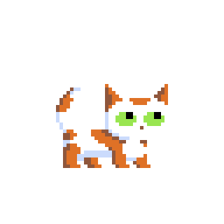

.. _index:

KITTY Imports Tiled Tilemaps, Yay!
==================================

	KITTY!

This is a `Tiled <https://www.mapeditor.org/>`_ importer for `Unity <https://unity3d.com/>`_.

KITTY differentiates itself from other Tiled importers through seamless basic integration, automatic
object-to-prefab instantiation, and friction-free translation from Tiled custom properties to C#
fields.

KITTY imports every graphic, object and setting you've defined in your Tiled tilemaps into Unity.

Unity's built-in tilemap editor is okay, but Tiled is `way` better. You can define stuff like text,
warps, and pickups directly in Tiled. KITTY just imports and applies all that seamlessly.

KITTY can't make custom behaviours without coding those behaviours, though. You still need to write
character controllers, enemy AI, interaction behaviours etc. yourself.

Seamless basic integration
--------------------------

KITTY supports importing Tiled's ``.tmx`` and ``.tsx`` file formats natively in Unity.

The importers automatically reimport when you change a tilemap or tileset outside of Unity.

Advanced Tiled features like Collision Shapes, per-frame animation framerate and tile objects *just
work*.

Automatic object-to-prefab instantiation
----------------------------------------

KITTY aggressively instantiates prefabs from Tiled objects based on the **Type** property in Tiled.

The suggested workflow is to make a prefab (or prefab variant) for each generic object or tile
object type, attach a bunch of components, and let the custom properties differentiate the specific
object instances.

Alternatively, you can mix and match manually created Unity objects with automatically imported
Tiled objects without losing your work.

Friction-free translation from Tiled custom properties
------------------------------------------------------

KITTY takes care of full Tiled Custom Property integration in your game.

The preferred approach to making your game aware of Custom Properties is to decorate relevant
fields with the ``[TiledProperty]`` attribute – this automatically assigns the value defined in
Tiled to your C# field.

KITTY automatically figures out the mapping from Tiled to C# based on the name of the C# field. If
you need direct control over the mapping, the ``TiledProperty`` attribute takes an optional ``name``
parameter for specifying the Tiled property name.

.. code-block:: c#
	:caption: Sign.cs

	public class Sign : MonoBehaviour {
		[TiledProperty] private string text;
		[TiledProperty("Text Speed")] private float speed;
	}

.. toctree::
   :maxdepth: 2
   :caption: Contents:

   manual/getting_started
   manual/tilesets_and_tilemaps
   manual/prefabs
   manual/map_and_layer_prefabs
   manual/properties
   manual/animations
   manual/tutorial
   manual/issues