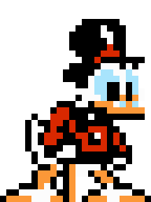

.. _animations:

Animations
==========

Tile animations defined in Tiled tilesets work as expected, and support per-frame durations.

By default, objects defined in Tiled tilemaps based on animated tiles also work as expected, looping
through each frame according to its duration.

Custom animation sequences
--------------------------

Sometimes, the frames of an animated tile aren't meant to be played fully in sequence; for example,
a character sprite sheet tileset might have animations for idle, run, and jump, all defined in the
same animation in Tiled.

The animation frames defined in tiled determine each frame's duration, as well. For more direct
control over playback speed, the ``Speed`` parameter can be used as a playback speed factor. It
defaults to ``1.0f``.

By setting the ``Start`` and ``End`` parameters of an object's child Animator component, any
subsequence can be played at any time.

For example, a ``CharacterController`` script with 4 idle frames followed by 6 walk frames might
contain the following:

.. code-block:: c#
	:caption: CharacterController.cs

	void Update() {
		var animator = GetComponentInChildren<Animator>();
		if (walking) {
			animator.SetParameter("Start", 4);
			animator.SetParameter("End", 9);
		} else {
			animator.SetParameter("Start", 0);
			animator.SetParameter("End", 3);
		}
	}

This code tells the ``Animator`` to cycle through frames 4 through 9 when walking. When not walking,
frames 0 through 3 are cycled through instead.

.. Note:: Frame indices start from 0.

	In the NES game DuckTales 2, Scrooge McDuck has 4 idle frames (3 unique) and 6 walk frames
	(5 unique)