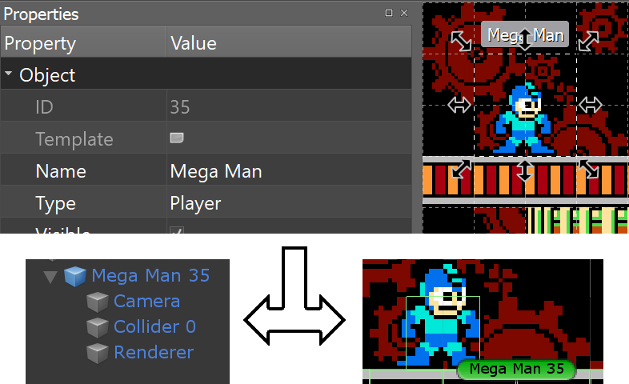
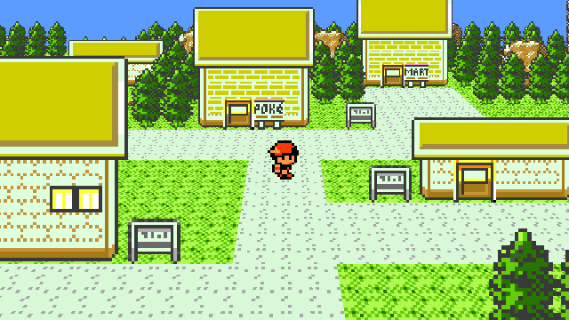

.. _prefabs:

Prefab instantiation
====================

By setting the **Type** property of a tile or object in Tiled, KITTY will instantiate the most
relevant prefab with a matching name from anywhere in the ``Assets`` folder.

Relevance is determined by how much of the prefab path matches the tilemap path.

Tile prefabs
------------

For tileset tiles with a defined **Type** property in Tiled, a prefab is instantiated at every
instance of that tile's position in a tilemap, unmodified except for rotation based on the tile's
flipping, if any.

.. Note:: When you change a prefab instantiated from a tileset, you need to reimport that tileset.

Object prefabs
--------------

Objects with a defined **Type** property in tiled will instantiate an instance of the most relevant
prefab with the same name as the **Type** property's value.

The instantiated ``GameObject``\ 's name is changed to match the name of the object in Tiled, if
any.

For example, a Tiled object with the **Name** :guilabel:`Mega Man` and the **Type**
:guilabel:`Player` will instantiate a prefab named :guilabel:`Player`, and change the instance's
name to :guilabel:`Mega Man`, followed by an object ID.

.. Note:: When you change a prefab instantiated from an object, you need to reimport the tilemap.

Tile object prefabs
-------------------

A tile object is an object in Tiled based on a tileset tile. It inherits graphics and properties
from its source tile, and the properties can be overwritten for each object instance.

If the tile object itself does not have an explicitly defined **Type**, it inherits the **Type** of
its source tile. This way, the object still instantiates a prefab, just based on the tile's **Type**
instead.

For tile objects, a child ``SpriteRenderer`` is automatically created to render the object's source
tile graphic.

For all Collision Shapes on the source tile of a tile object, a child ``PolygonCollider2D`` is
created as well.

	Translation from a Tiled object to a Unity prefab

If the source tile of a tile object is animated, an ``Animator`` with a preconfigured
``AnimatorController`` is also added to the :guilabel:`Renderer` ``GameObject``. This is described
in more detail in the :ref:`animations` section.

Position and rotation
---------------------

Prefabs are instantiated with their origin at the tile or object's bottom left corner. "Bottom left"
is relative to the rotation and flipping, so prefabs have correct rotations and positions.

Prefabs retain their initial rotation when instantiated; the rotation and flipping defined in Tiled
is compounded with the initial rotation.

	Fun with initial prefab rotation of 60° around the X-axis.

Properties
----------

If a field on a ``MonoBehaviour`` attached to the prefab (or any children) is decorated with the
``[TiledProperty]`` attribute, the value of that field is set based on a Tiled object or source
tile's Custom Property of the same name – case-insensitive, and stripped for whitespace.

This is described in more detail in the :ref:`properties` section.