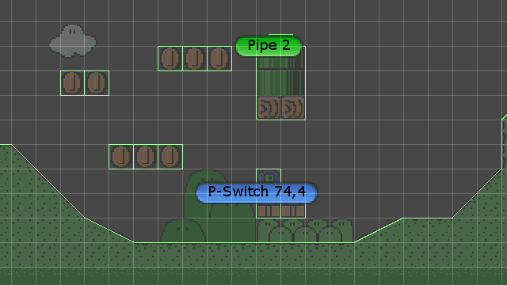

.. _tilesets_and_tilemaps:

Tilesets and Tilemaps
=====================

Tiled is a piece of software that allows you to define tilesets and tilemaps.

KITTY imports those tilesets and tilemaps into Unity, using the native ScriptedImporter class.

Tiles
-----

Each tileset tile defines what form the tile will take in a tilemap in Unity.

For example, if the tile has an animation in a Tiled tileset, it'll be animated in Unity, too.

Collision Shapes defined in a Tiled tileset translate directly into the tilemap's ``Collider``, as
well.

	Composite collider

Additionally, if the tile has a defined **Type** in a Tiled tileset, a prefab named after that
**Type** will be instantiated automatically at the tile's position. This is described in more detail
in the :ref:`prefabs` section.

.. Note:: When importing any tilemap, a tile is exactly one Unity unit wide – if the tilemap tiles are square,
	the tiles are one Unity unit tall, as well.

Files
-----

A Tiled tileset is defined in a ``.tsx``-file. For regular, grid-based tilesets, a ``.tsx``-file has
exactly one associated image. For image collection tilesets, every tile has a separate associated
image.

.. Note:: KITTY automatically adds a 1-pixel border to each grid-based tileset tile before using it.
	This keeps the tiles from bleeding into each other, even with weird camera angles or settings.

Tiled tilemaps are defined in ``.tmx``-files, and reference one or multiple ``.tsx``-files for the
tiles in the tilemap.

For ease of import and use, I suggest creating images and their related tilesets and tilemaps in the
same folder, somewhere inside your project's ``Assets`` folder.

.. Note:: KITTY is entirely non-destructive, so keeping the source images, tilesets and tilemaps somewhere in
	the ``Assets`` folder is not a risk.

Automatic reloading
-------------------

KITTY automatically loads any changed image, tileset or tilemap, and any asset depending on the
changed file.

This means that when you edit images, configure tilesets or draw on tilemaps, Unity will apply the
changes immediately.

.. Note:: Tiled recommends avoiding a change in tileset width – ie. how many tiles are in a row. As
	such, you should add new tile rows to the bottom of the tileset image, if necessary.