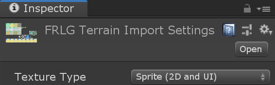
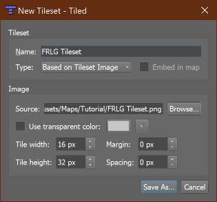
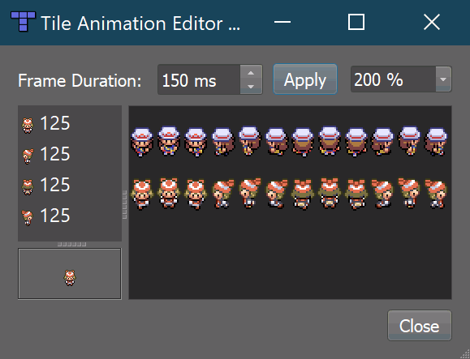

.. _tutorial:

Tutorial
========

Thank you for using KITTY!

This tutorial takes you through making a small top-down game from scratch, using Tiled to make
your game. KITTY imports it into Unity, where you can add game-specific behaviours to tiles and
objects from Tiled.

The end result is a grid-based, animated character controller able to interact with signs, NPCs,
and doors which are all defined in Tiled. It plays like this:

.. figure:: images/tutorial-teaser.gif
	:align: center

	Tutorial teaser

Keep in mind that this is just an example project to get you started; KITTY can do much, much
more than what this tutorial teaches.

Learning how to use Tiled is not part of this tutorial. Have a look at the `Official Tiled
Documentation <https://docs.mapeditor.org/>`_ for that.


TL;DR
-----

- Make tilemaps in Tiled with typed and possibly animated objects
- Make prefabs in Unity with names that match Tiled objects' types
- Add built-in or custom components in Unity to your prefabs
- Import, change, and reimport your tilemaps in Unity as needed


Images, Tilesets and Tilemaps
-----------------------------

To begin making a tile-based game, you need to make or find neat tileset images with the same tile
size. These determine what tiles you can build your map with, and to some extent what objects you
can make.

You also need some character spritesheets, which are effectively also a form of tileset, but since
we'll be using them for objects rather than tiles, they don't have to have the same tile size as
your tilesets.

I went with tilesets and spritesheets from Pokémon FireRed/LeafGreen, modified to fit into a grid.
Of course, if you plan to distribute your game, you can't use tiles or sprites you don't have a
license to.


Tileset Images
``````````````

Place the tileset images somewhere in the Assets folder, like in ``Assets/Maps/Tutorial``. Ideally,
the Tiled tilesets and tilemaps you're going to create will end up here, as well. Keeping
map-related images, tilesets, and tilemaps together makes it easier to maintain references and
update the files as you make your game.

Make sure to change the Texture Type in the image import settings to **Sprite (2D and UI)** –
this takes care of proper scaling, and is the most fitting texture type for tiles and sprites.



	Image import settings

If you're making a pixel art game, you also want to set the Filter Mode to
**Point (no filter)**, and Compression to **None**. This keeps your pixels crisp.

Tilesets
````````

Create a new tileset in Tiled for each of your tileset images, and save them in
``Assets/Maps/Tutorial`` as well. Tilesets get the extension ``.tmx``, so don't worry about naming
them differently from the source image's filename.

Make sure to set the **Tile width** and **Tile height** to match the tileset images' tile size.
If your tileset's tiles have borders around them, you can set the margin and spacing
accordingly.



	New tileset settings

If you haven't worked with Tiled before, I recommend looking into
`Using the Terrain Brush <https://docs.mapeditor.org/en/stable/manual/using-the-terrain-tool/>`_ in
the official documentation, but don't sweat it.

Feel free to define animations for any animated tiles in your tileset, as well. These will carry
over to Unity with no extra setup.

Tilemaps
````````

Now that you have some tilesets, it's time to make a tilemap!

Anything goes, really. You don't have to worry about interactable stuff like signs or NPCs just
yet – we'll get to those a bit further down. Feel free to add more Tile Layers if you need them.


	Modified Pewter City

I made a slightly changed Pewter City from Pokémon FireRed/LeafGreen.

Note that I didn't bother adding signs yet, and I left out some doors. I will add those to an object
layer later – that way I can directly define the sign texts and door destinations, respectively.

Like the tileset, you want to save your tilemap in ``Assets/Maps/Tutorial``.


Initial Unity Import
--------------------

Go ahead and drop the entire KITTY Unity Package into the root of your Assets folder.

If you saved your tilesets and tilemaps next to your tileset images, the folder contents should now
look a bit like this:

.. figure:: images/tutorial-folder0.png
	:align: center

	The colourful Tiled icons are tilesets, and the tilemap has been made into a prefab.

You can drop the tilemap prefab directly into the **Hierarchy** to see your work in the **Scene**
view.

.. Note:: Whenever you update your tilesets or tilemaps, or edit your tileset images, they
	automatically get reimported.

If you go into **Play Mode** now, any animated tiles will animate, but nothing else really happens.
We're going to change that!


Player Object
-------------

Of course, there are no objects yet – not even a :guilabel:`Player`. Let's add a small character
from a spritesheet, ideally with a few walking animation frames for each of the four directions. I went
with `Leaf` from `Pokémon FireRed/LeafGreen`.

Character and object spritesheets don't need to have the same tile size as the tilemap, as they're
not part of the grid. `Leaf`'s spritesheet, for example, uses 16×32 pixel sprites for each animation
frame.

.. Note:: You can make Tiled snap objects and other things to the tile grid by toggling it in **View
	-> Snapping -> Snap to Grid**.

We can insert sprites of any size anywhere in the map as objects by adding an Object Layer. I called
my layer :guilabel:`Characters`, added a Tile Object of `Leaf` from the character spritesheet, and
set the object's name to :guilabel:`Leaf`. You don't have to give your objects names, but since they
carry over to Unity, it will be easier to tell them apart if you do.


	Player object in Tiled

So far, so good. When you switch to Unity now, you'll see your character gets created as a
``GameObject`` with the name you specified, followed by an object ID. A ``SpriteRenderer`` child has
automatically been added, and the ``GameObject`` even a small name label.

.. figure:: images/tutorial-leaf-gameobject.png
	:align: center

	Player object in Unity

That's all well and good, but the player doesn't do anything, and adding components manually to
every object that needs any will get tedious quickly.

Player Prefab
`````````````

KITTY automatically generates a ``SpriteRenderer`` for us, and if your character sprite already has
an animation defined, the :guilabel:`Renderer` child will have a fully configured ``Animator``
component as well. You could even go so far as to add collision shapes to your character sprite,
which would generate a ``PolygonCollider2D`` for each shape, but you won't need to do that for your
character in this tutorial.

The ability to control how Tiled objects are translated to ``GameObject``\ s is the primary feature
of KITTY, however!

Let's have the ``Camera`` component on the :guilabel:`Player` ``GameObject`` instead of at the root
of the scene.

Start by removing the :guilabel:`Main Camera` ``GameObject`` from the scene. This will make the
**Game** view complain about a missing ``Camera``.

Add an empty ``GameObject`` to the scene; this will become our :guilabel:`Player` prefab. Drag it
from the scene **Hierarchy** to the **Project** view to save it as a prefab asset – anywhere in the
``Assets`` folder is fine, but let's drag it into ``Assets/Maps/Tutorial`` for now. It's important
to name it :guilabel:`Player` or something similar, because KITTY uses prefab names to translate
from Tiled objects to ``GameObject``\ s.

Now that you have your empty :guilabel:`Player` prefab in your ``Assets`` folder, go ahead and
delete the :guilabel:`Player` instance from the scene, then double click the prefab to enter
**Prefab Edit Mode**.

Add an empty child ``GameObject`` named :guilabel:`Camera` to the prefab, and set its position to
``(0.5, 0.5, -10)``; every tile and object imported from Tiled is created at its bottom left
position, so to center the :guilabel:`Camera` child on the :guilabel:`Player` character, it needs to
be offset by half the width of a "tile" in your spritesheet. The ``-10`` Z-position is just to make
sure the ``Camera`` doesn't clip the tilemap and all its objects.

Finally for now, add a ``Camera`` component to the new :guilabel:`Camera` child, and set its
Projection to **Orthographic**.

.. figure:: images/tutorial-camera-inspector.png
	:align: center

We'll return to the :guilabel:`Player` prefab to add more functionality later!

.. Note:: If you want objects based on your new prefab to still have a label, you can choose a label
	in the icon dropdown of your root :guilabel:`Player` ``GameObject`` in the top left corner of
	the inspector.

Typed Objects
`````````````

To let KITTY know that the character you added to the :guilabel:`Characters` object layer in Tiled
should use your new Player prefab for instantiation, all you need to do is set the **Type** property
of the object in Tiled.

.. figure:: images/tutorial-player-object.png
	:align: center

Switching back to Unity, your **Game** view now shows the "game" with your character in the center.

.. Note:: This approach – creating a named prefab (or prefab variant) and setting the "Type"
	property of an object or even a tile in Tiled – is the core way of defining the specific
	behaviours of your game.


Movement Script
---------------

Now we actually get to add game-specific behaviour to our game. First up is :guilabel:`Player`
movement.

Adding Behaviours to Objects
````````````````````````````

Whenever a tile or object in Tiled has the **Type** :guilabel:`Player`, KITTY loads your
:guilabel:`Player` prefab in its place. This holds true for any typed Tiled object/Unity prefab
combination with matching names.

To define behaviours for objects, you simply add the components and child ``GameObject``\ s you need
to the prefab that matches the object **Type** you want to define behaviours for.

Grid Movement
`````````````

Let's make the :guilabel:`Player` able to move by pressing the arrow keys (or any other directional
input, like WASD or a joypad). For this tutorial, the player can move either horisontally or
vertically, but not both at the same time.

Create a new C# script called ``GridController`` somewhere in your ``Assets`` folder with the
following contents:

.. code-block:: c#
	:caption: GridController.cs

	using UnityEngine;

	public class GridController : MonoBehaviour {
		void Update() {
			var input = new Vector2(Input.GetAxisRaw("Horizontal"), Input.GetAxisRaw("Vertical"));

			// Move one tile in an input direction, if any, preferring horizontal movement.
			if (input.x != 0f) {
				transform.position += new Vector3(input.x, 0).normalized;
			} else if (input.y != 0f) {
				transform.position += new Vector3(0, input.y).normalized;
			}
		}
	}

.. Note:: I'm using ``Input.GetAxisRaw`` to get the raw input data between ``-1`` and ``1``, and
	normalizing it to get a direction vector.

Now just add this new ``GridController`` component to your :guilabel:`Player` prefab by
double-clicking the prefab asset, and dragging or adding the component to the prefab's root
``GameObject`` (called :guilabel:`Player`). Reimport your tilemap to make Unity apply the changes to
your :guilabel:`Player` prefab.

.. figure:: images/tutorial-grid-movement.gif
	:align: center

	Moving one tile per frame

Tile widths in KITTY are always exactly one Unity unit wide, so moving one unit in any direction
corresponds exactly to moving one tile in that direction. Because we're always adding integers,
the character position doesn't suffer from floating point inaccuracies.

.. Note:: When you change a prefab, you need to reimport any tilemaps or tilesets that use that
	prefab.

If you reimport your tilemap and go into **Play Mode**, the character moves when you give it
directional input, and it also stays exactly on the tile positions – but it's way too fast,
potentially moving one tile per frame!

Continuous Movement
```````````````````

When receiving directional input, we want the character to move a little bit every frame until it
reaches the next tile. There are many ways to make things happen over time, but this is a KITTY
tutorial, not a C# or Unity tutorial.

Let's just add a small ``Walk`` method in our ``GridController`` class that does everything we want;
it moves the character a little bit each frame until it reaches the next tile.

We'll be using an ``IEnumerator`` to call the method as a coroutine, so you need to add
``using System.Collections`` to the top of the file, as well.

.. code-block:: c#
	:caption: GridController.cs
	:emphasize-lines: 2,5-19

	using UnityEngine;
	using System.Collections;

	public class GridController : MonoBehaviour {
		///<summary>Walk to tile in `direction`.</summary>
		IEnumerator Walk(Vector3 direction) {
			// Disable the Update method until we're done walking one tile.
			enabled = false;

			// Move towards target, 1/16th tile per frame
			var target = transform.position + direction;
			while (transform.position != target) {
				transform.position = Vector3.MoveTowards(transform.position, target, 1f / 16f);
				yield return null; // Wait for one frame before continuing.
			}

			// Enable the Update method after we're done walking one tile.
			enabled = true;
		}
	// …
	}

.. Note:: Moving by 1/16th unit won't introduce floating point inaccuracies, because it's a negative
	power of two.

We need to update the ``Update`` method to call our new ``Walk`` method as a coroutine, as well:

.. code-block:: c#
	:caption: GridController.cs
	:emphasize-lines: 3,5

	// …
	if (input.x != 0f) {
		StartCoroutine(Walk(new Vector3(input.x, 0).normalized));
	} else if (input.y != 0f) {
		StartCoroutine(Walk(new Vector3(0, input.y).normalized));
	}
	// …

Calling ``Walk`` as a coroutine makes it able to stop for a bit and continue on the next frame,
instead of running all the code immediately.

.. figure:: images/tutorial-continuous-movement.gif
	:align: center

	Moving one pixel per frame

This is very useful to us, since we want to move a little bit, wait for the next frame, and then
move a little bit more – until we reach the target tile.


Colliders and Collision
-----------------------

The :guilabel:`Player` is currently unstoppable; there's nothing to collide against, and no
collisions ever happen.

Colliders
`````````

KITTY natively understands Collision Shapes defined in Tiled tilesets, and turns them into
Sprite Physics Shapes – sprite/tile ``Collider``\ s. The entire tilemap has a ``CompositeCollider``
component that composes all the individual tile layer colliders into one, for performance reasons.

This also means you can't query `what` tile an object collided with, as Unity sees them all as the
same, full-map composite collider. That's fine for simple non-interactive collision shapes, though.

Since we're making a grid-based topdown game, square collision shapes will suffice.

Open one of your tilesets in Tiled, switch to Tile Collision Editor mode in the top middle, and
start drawing full-tile collision shapes for all the tiles that should be collidable.

.. figure:: images/tutorial-collision-shapes.gif
	:align: center

	Adding tile Collision Shapes in the tileset

By defining the collisions in the tileset rather than the tilemap, the Collision Shapes are reused;
you only need to define them once for each tile in the tileset, instead of having to make sure every
collidable tile in your tilemap has a collider defined.

This is the reason KITTY imports tile Collision Shapes, but not object shapes, as colliders.

Back in Unity, the tilemap now has a ``Collider`` with all the Collision Shapes you defined.


	I lowered the tilemap opacity to make the ``Collider`` more visible in the **Scene** view.

Collision
`````````

Your entire tilemap automatically got a full-map ``Collider`` in Unity by just defining a few tile
Collision Shapes in your Tiled tileset. Neat.

The ``Collider`` doesn't stop the :guilabel:`Player` yet, though. One way of making
``GameObject``\ s interact with ``Collider``\ s in Unity is to add a ``Collider2D`` and a
``Rigidbody2D`` component, but since we don't need physics, just collisions, we can instead add a
simple collision check around the ``Walk`` method's movement loop in our ``GridController`` class.

.. code-block:: c#
	:caption: GridController.cs
	:emphasize-lines: 2-8,15

	// …
	// BoxCast from the character's center, in the desired direction, to check for collisions.
	var origin = transform.position + new Vector3(0.5f, 0.5f);
	var size = Vector2.one / 2f; // Half box size to avoid false positives.
	var hit = Physics2D.BoxCast(origin, size, angle: 0f, direction, distance: 1f);
	if (hit) {
		// Nothing to do, don't move.
	} else {
		// Move towards target, 1/16th tile per frame
		var target = transform.position + direction;
		while (transform.position != target) {
			transform.position = Vector3.MoveTowards(transform.position, target, 1f / 16f);
			yield return null; // Wait for one frame before continuing.
		}
	}
	// …

This code addition simply makes sure we only run the movement loop if the :guilabel:`Player` won't
collide with anything at the target position.

.. figure:: images/tutorial-collision.gif
	:align: center

	Collisions limit :guilabel:`Player` movement

If you enter **Play Mode** now, the :guilabel:`Player` character is no longer able to pass through
the tiles you defined Collision Shapes for in your tilesets.


Occlusion with Tile Masks
-------------------------

A non-essential improvement we can make is to let the :guilabel:`Player` walk behind/under things
like roofs and treetops – since my :guilabel:`Characters` layer is on top of all other layers, the
:guilabel:`Player` character currently renders on top of everything.

You `could` add another Tile Layer above the :guilabel:`Characters` layer, and make sure everything
that should occlude the :guilabel:`Player` character is placed in that layer, and not its original
layer.

I find non-semantic layers like that tedious, repetitious, and error-prone, though.

Let's define occluding tiles directly in the tileset, instead; we'll use a prefab with a
``SpriteMask`` component, and a small script that synchronises the ``SpriteMask``'s ``Sprite`` with
the tile's ``Sprite``.

Create a script called ``TileMask``:

.. code-block:: c#
	:caption: TileMask.cs

	using UnityEngine;
	using UnityEngine.Tilemaps;

	[RequireComponent(typeof(SpriteMask))]
	public class TileMask : MonoBehaviour {
		void Start() {
			var tilemap = GetComponentInParent<Tilemap>();
			var position = Vector3Int.FloorToInt(transform.localPosition);
			var sprite = tilemap.GetSprite(position);
			GetComponent<SpriteMask>().sprite = sprite;
			transform.localPosition += (Vector3)(sprite.pivot / sprite.pixelsPerUnit);
		}
	}

Since the ``Sprite``'s pivot will be read as centered, the ``Transform``'s ``localPosition`` is
aligned to the center of the tile.

Now create a new prefab called :guilabel:`Mask`, and add your new ``TileMask`` component to it. A
``SpriteMask`` component will automatically be added as well, because of the ``RequireComponent``
class attribute.

Finally, in your tileset in Tiled, select all tiles that should occlude objects, and set their
**Type** to :guilabel:`Mask`. This will make KITTY instantiate your new :guilabel:`Mask` prefab at
every one of those tiles' positions in your tilemap.

.. figure:: images/tutorial-mask.gif
	:align: center

	The :guilabel:`Player` is masked by the :guilabel:`Mask` tiles.

This approach of defining the occlusion directly in the tileset means you avoid repeating the
occlusion definition, don't have to wrestle with multiple layers, and can't forget to make a tile in
the tilemap occlude the :guilabel:`Player`.

.. Note:: If you make changes to a prefab for tileset tiles, you need to reimport the tileset, which
	will automatically reimport the tilemap as well.


Interactions
------------

We have a working prototype for a playable game, now! There's no way for the :guilabel:`Player` to
interact with the world, though. Let's add signs the :guilabel:`Player` can read.

Custom Properties
`````````````````

Tiled allows you to add Custom Properties to almost everything, from maps and layers to tiles and
objects.

KITTY allows you to assign the value of a Custom Property to a field in one or more of your classes,
through the ``[TiledProperty]`` attribute. We'll use that to define the text on the signs.

Simple Sign
```````````

Create a new prefab called :guilabel:`Sign`, add a child with a ``Canvas`` component, and add a
child with a ``Text`` component to the :guilabel:`Canvas` child. Configure the text to be visible
even when there's a few lines in the ``Text`` component, then disable the :guilabel:`Canvas` child
``GameObject`` so it doesn't start visible.

Feel free to make it look fancy; I added a background panel and a custom font.


	My :guilabel:`Sign` prefab

Create a new ``Sign`` C# script, and add this component to the root of the :guilabel:`Sign` prefab:

.. code-block:: c#
	:caption: Sign.cs

	using System.Collections;
	using KITTY;
	using UnityEngine;
	using UnityEngine.UI;

	public class Sign : MonoBehaviour {
		public GameObject canvas;
		[TiledProperty] public string text;

		public IEnumerator Interact() {
			// Enable the text canvas, and wait for the player to press the "Fire1" button.
			canvas.SetActive(true);
			GetComponentInChildren<Text>().text = text;
			while (!Input.GetButtonDown("Fire1")) {
				yield return null;
			}
			canvas.SetActive(false);
		}
	}

Remember to add a reference to your :guilabel:`Canvas` ``GameObject`` in the ``Sign`` component's
inspector.

The ``[TiledProperty]`` attribute lets us assign the value of any Custom Property named **Text**
(case-insensitive, ignoring whitespace) directly from an object or tile in Tiled directly to our
``public string text`` property. `Nice`.

We're returning an ``IEnumerator`` again, because we want the ``GridController`` to wait for the
"Fire1" button to be pressed before enabling its ``Update`` method again.

.. Note:: The default "Fire1" buttons are Ctrl, left mouse button, and joypad button 1.

We need to add a few lines of code to the ``GridController`` class as well. It needs to wait for the
``Interact`` coroutine to finish when there `is` a BoxCast hit, `and` the collider that was hit also
has a ``Sign`` component.

.. code-block:: c#
	:caption: GridController.cs
	:emphasize-lines: 3-7

	// …
	if (hit) {
		// Interact with a Sign, if any.
		var interaction = hit.collider.GetComponentInParent<Sign>()?.Interact();
		if (interaction != null) {
			yield return StartCoroutine(interaction);
		}
	} else {
	// …

Coroutines can start other coroutines, and even wait for them; the ``GridController``'s ``Walk``
method will now wait for the ``Sign``'s ``Interact`` method to complete before enabling the
``GridController``'s ``Update`` method again with ``enabled = true;``

We fetch the ``Sign`` component through ``collider.GetComponentInParent<Sign>()`` because KITTY
automatically adds one or more child ``Collider``\ s – based on a tile's Collision Shapes – to
instantiated prefabs.

Back to Tiled; we need to make sure that in our tileset, our sign tile has the **Type**
:guilabel:`Sign`, and has a full-tile Collision Shape. You can add a default ``string`` Custom
Property named **Text**, as well; its value will be used as sign text if you don't give a sign a
specific text.


	Properties for :guilabel:`Sign` tile

If you have several different sign tiles you want to use, just repeat the process for all of them.

Now, add as many Tile Object Signs as you want to your tilemap, and add or change their **Text**
Custom Property individually.

.. figure:: images/tutorial-unity-signs.gif
	:align: center

	Signs showing a text box and waiting for input

Switch back to Unity, enter **Play Mode**, and walk into a sign; with a few lines of code and a
single Custom Property, you're now able to interact with the game world!


Directional "Sign"
``````````````````

Before we start animating the :guilabel:`Player`, let's improve our ``Sign`` component a bit;
depending on how you look at it, a stationary NPC that faces the :guilabel:`Player` when speaking is
really just a `Directional "Sign"`. For my NPC, I went with four directional sprites of `May` from
`Pokémon FireRed/LeafGreen`.

Instead of having separate classes and prefabs for :guilabel:`Sign`\ s and stationary NPCs, we can
just make our ``Sign`` component face the :guilabel:`Player` if it has different frames for the four
directions.

.. code-block:: c#
	:caption: Sign.cs
	:emphasize-lines: 2-12

	// …
	public IEnumerator Interact(Transform actor) {
		// Display a specific direction frame to face the player.
		var animator = GetComponentInChildren<Animator>();
		var direction = actor.position - transform.position;
		var frame = 0;
		if      (direction == Vector3.down)  { frame = 0; }
		else if (direction == Vector3.left)  { frame = 1; }
		else if (direction == Vector3.up)    { frame = 2; }
		else if (direction == Vector3.right) { frame = 3; }
		animator?.SetInteger("Start", frame);
		animator?.SetInteger("End", frame);

		// Enable the text canvas, and wait for the player to press the "Fire1" button.
		// …
	}
	// …

To determine the direction the :guilabel:`"Sign"` should face, we need to know what ``Transform`` is
interacting with it; so, a ``Transform`` parameter has been added to the ``Interact`` method.

Depending on the direction, we select one of the four directional frames for our NPC
:guilabel:`"Sign"`.

KITTY automatically adds a preconfigured ``Animator`` component to the automatically created
:guilabel:`Renderer` ``GameObject`` of every Tiled tile object that's based on an animated tile.

We can set a subsequence of frames for this ``Animator`` at any time by specifying its ``Start`` and
``End`` properties. By setting both to the same value, the "animation" effectively turns into a
single frame – the directional frame we want.

The ``GridController`` needs to pass in its ``Transform`` when calling ``Interact``, too.

.. code-block:: c#
	:caption: GridController.cs

	var interaction = hit.collider.GetComponentInParent<Sign>()?.Interact(transform);

The only thing you need to do in Tiled is to define a short animation for your NPC
:guilabel:`"Sign"`, with one frame for each of the four directions. Make sure the main tile has the
**Type** :guilabel:`Sign`, and a defined collision shape.



	Four animation frames; one for each direction

Place a few NPC :guilabel:`"Sign"`\ s, add a ``string`` Custom Property named **Text** with whatever
text you want, and they will turn to face the :guilabel:`Player` when interacted with in Unity's
**Play Mode**.


	NPC :guilabel:`"Sign"` in action

She spins! By default, objects based on animated tiles will play out their full sequence of frames
in a loop. If you want to have the :guilabel:`"Sign"` start facing one direction, just set the
``Start`` and ``End`` parameters of the ``Animator`` to the same frame number in a ``Start`` method.

Remember to check whether the ``GameObject`` `has` an ``Animator`` component, first.

.. Tip:: Using ``animator?.SetParameter`` will not call ``SetParameter`` if ``animator == null``.


Animating the Player
--------------------

We'll use the same approach as the directional :guilabel:`"Sign"` for animating the
:guilabel:`Player`; setting the ``Start`` and ``End`` parameters of the automatically created child
``Animator`` component to select animation sequences.

.. figure:: images/tutorial-leaf.gif
	:align: center

	:guilabel:`Player` sprite animation

`Leaf` from `Pokémon FireRed/LeafGreen` has three walking frames for each of the four directions,
but her actual animation uses the middle frame twice.

Facing
``````

Since `Leaf` has four walking frames per direction in her defined tile animation, the frame indices
for each direction have a stride of four instead of one. In our ``GridController``'s ``Walk``
method:

.. code-block:: c#
	:caption: GridController.cs
	:emphasize-lines: 4-10

	// …
	enabled = false;

	// Animation frame sequence depends on directions.
	var animator = GetComponentInChildren<Animator>();
	var frame = 0;
	if      (direction == Vector3.down)  { frame =  0; }
	else if (direction == Vector3.left)  { frame =  4; }
	else if (direction == Vector3.up)    { frame =  8; }
	else if (direction == Vector3.right) { frame = 12; }
	// …

Now that we have a frame offset for the direction, we can set a static frame facing that direction
if the :guilabel:`Player` collides with anything:

.. code-block:: c#
	:caption: GridController.cs
	:emphasize-lines: 3-5

	// …
	if (hit) {
		// Set static frame facing the collider.
		animator?.SetInteger("Start", frame + 1);
		animator?.SetInteger("End", frame + 1);
	// …

I add ``1`` to the frame offset because Leaf's animation frames are `left-foot`, `center`,
`right-foot`, `center`, and I want her static frame to be a center frame.

It's important to set the ``Animator`` parameters `before` a potential ``Interact`` coroutine is
started; that way, the :guilabel:`Player` will face a :guilabel:`Sign`, an NPC, or any other
interactable object while waiting for the ``Interact`` coroutine to finish.

Animation
`````````

Animating your character's movement is done in the same way as setting a static frame, except the
``Start`` and ``End`` parameters are different from each other.

To animate Leaf with her four frames of animation, I simply define the subsequence of directional
frames I want to play while she moves, wait for her to finish moving, and reset to a directional
static frame:

.. code-block:: c#
	:caption: GridController.cs
	:emphasize-lines: 3-5,10-12

	// …
	} else {
		// Set walking animation frame sequence.
		animator?.SetInteger("Start", frame);
		animator?.SetInteger("End", frame + 3);

		// Move towards target, 1/16th tile per frame
		// …

		// Reset to idle.
		animator?.SetInteger("Start", frame + 1);
		animator?.SetInteger("End", frame + 1);
	}
	// …

Now we've defined both an idle animation and a walking animation, for all four directions, in six
lines of code. Wonderful!

.. figure:: images/tutorial-animation.gif
	:align: center

	Walking animation plays when the :guilabel:`Player` moves

.. Note:: Leaf, like May, initially plays her entire animation sequence in a loop. If you want to
	have your character face a specific direction from the start instead, just set both the
	``Start`` and ``End`` parameters to the frame index you want in a ``Start`` method.


Recap
-----

That concludes this tutorial in using Tiled and KITTY to make a small top-down game with Unity.

Let's go through what we've made.

Files
`````

We don't really have that many files, despite having a small functioning game.


	**Project** folder contents
	
The contents of my ``Assets/Maps/Tutorial`` folder looks like this. Yours should be roughly
similar, though probably with a different number of tilesets and images.

Scene Hierarchy
```````````````

The scene **Hierarchy** just contains the tilemap prefab, and nothing else.


	Final scene **Hierarchy**

As you can see, there are no floating ``GameObject``\ s to keep track of. I recommend making one fully
self-contained scene per tilemap – that way, you can change mechanics as you see fit from one map
to the next.

Code
````

Finally, we ended up with just three scripts to describe all the behaviour in our game.

.. code-block:: c#
	:caption: GridController.cs

	using System.Collections;
	using UnityEngine;

	public class GridController : MonoBehaviour {
		///<summary>Walk to tile in `direction`.</summary>
		IEnumerator Walk(Vector3 direction) {
			// Disable the Update method until we're done walking one tile.
			enabled = false;

			// Animation frame sequence depends on directions.
			var animator = GetComponentInChildren<Animator>();
			var frame = 0;
			if      (direction == Vector3.down)  { frame =  0; }
			else if (direction == Vector3.left)  { frame =  4; }
			else if (direction == Vector3.up)    { frame =  8; }
			else if (direction == Vector3.right) { frame = 12; }

			// BoxCast from the character's center, in the desired direction, to check for collisions.
			var origin = transform.position + new Vector3(0.5f, 0.5f);
			var size = Vector2.one / 2f; // Half box size to avoid false positives.
			var hit = Physics2D.BoxCast(origin, size, angle: 0f, direction, distance: 1f);
			if (hit) {
				// Set static frame facing the collider.
				animator?.SetInteger("Start", frame + 1);
				animator?.SetInteger("End", frame + 1);

				// Interact with a Sign, if any.
				var interaction = hit.collider.GetComponentInParent<Sign>()?.Interact(transform);
				if (interaction != null) {
					yield return StartCoroutine(interaction);
				}
			} else {
				// Set walking animation frame sequence.
				animator?.SetInteger("Start", frame);
				animator?.SetInteger("End", frame + 3);

				// Move towards target, 1/16th tile per frame
				var target = transform.position + direction;
				while (transform.position != target) {
					transform.position = Vector3.MoveTowards(transform.position, target, 1f / 16f);
					yield return null; // Wait for one frame before continuing.
				}

				// Reset to idle.
				animator?.SetInteger("Start", frame + 1);
				animator?.SetInteger("End", frame + 1);
			}

			// Enable the Update method after we're done walking one tile.
			enabled = true;
		}

		void Update() {
			var input = new Vector2(Input.GetAxisRaw("Horizontal"), Input.GetAxisRaw("Vertical"));

			// Move one tile in an input direction, if any, preferring horizontal movement.
			if (input.x != 0f) {
				StartCoroutine(Walk(new Vector3(input.x, 0).normalized));
			} else if (input.y != 0f) {
				StartCoroutine(Walk(new Vector3(0, input.y).normalized));
			}
		}
	}

.. code-block:: c#
	:caption: TileMask.cs

	using UnityEngine;
	using UnityEngine.Tilemaps;

	[RequireComponent(typeof(SpriteMask))]
	public class TileMask : MonoBehaviour {
		void Start() {
			var tilemap = GetComponentInParent<Tilemap>();
			var position = Vector3Int.FloorToInt(transform.localPosition);
			var sprite = tilemap.GetSprite(position);
			GetComponent<SpriteMask>().sprite = sprite;
			transform.localPosition += (Vector3)(sprite.pivot / sprite.pixelsPerUnit);
		}
	}

.. code-block:: c#
	:caption: Sign.cs

	using System.Collections;
	using KITTY;
	using UnityEngine;
	using UnityEngine.UI;

	public class Sign : MonoBehaviour {
		public GameObject canvas;
		[TiledProperty] public string text;

		public IEnumerator Interact(Transform actor) {
			// Display a specific direction frame to face the player.
			var animator = GetComponentInChildren<Animator>();
			var direction = actor.position - transform.position;
			var frame = 0;
			if      (direction == Vector3.down)  { frame = 0; }
			else if (direction == Vector3.left)  { frame = 1; }
			else if (direction == Vector3.up)    { frame = 2; }
			else if (direction == Vector3.right) { frame = 3; }
			animator?.SetInteger("Start", frame);
			animator?.SetInteger("End", frame);

			// Enable the text canvas, and wait for the player to press the "Fire1" button.
			canvas.SetActive(true);
			GetComponentInChildren<Text>().text = text;
			while (!Input.GetButtonDown("Fire1")) {
				yield return null;
			}
			canvas.SetActive(false);
		}
	}


Going Forward with KITTY
------------------------

KITTY can do much more than just top-down orthogonal grid-based games.

With what you've learned in this tutorial, you can go on to make platformers with complex collision
shapes, turn-based strategy games with building mechanics, 3D tile-based first person games, or even
improve upon KITTY itself.

Good luck!

This Tutorial
`````````````

You should be able to build on what you've made with this tutorial.

For your next step, I have a few suggestions:

- Make :guilabel:`Door`\ s "warp" the :guilabel:`Player` to different maps by loading entire scenes
  by their name
- Expand the text boxes used for :guilabel:`Sign`\ s to support multiple pages, prompts, variables,
  and so on
- Add :guilabel:`NPC`\ s that walk around randomly

KITTY Examples
``````````````

We currently only have one published game made with KITTY.

It's called `PiRATS <https://elyon.itch.io/pirats>`_, it got second place in `Mini Jam 28
<https://itch.io/jam/mini-jam-28-pirates>`_, and it's made by `Fmlad <https://fmlad.itch.io/>`_ and
`myself <https://elyon.itch.io/>`_.

The game is short but kinda neat, we'd be happy if you would check it out~


Thank you again for using KITTY!
--------------------------------

KITTY is just a hobby project I've been working on for a while.

It means a lot to me that you got through this tutorial, so thank you.

If you spot anything weird or wrong in this tutorial, or you find a bug or missing feature in KITTY,
you're welcome to `contact me <mailto:emma.o.ewert@gmail.com>`_.