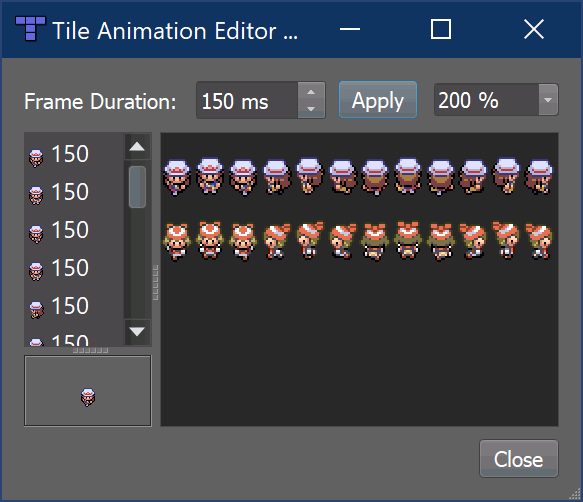

.. _tutorial:

Getting Started
===============

Thank you for using KITTY!

This tutorial takes you through making a small top-down game from scratch, using Tiled to make
your game. KITTY imports it into Unity, where you can add game-specific behaviours to tiles and
objects from Tiled.

The end result is a grid-based, animated character controller able to interact with signs, NPCs,
and doors which are all defined in Tiled. It plays like this:


Keep in mind that this is just a quick example project to get you started; KITTY can do much, much
more than what this tutorial teaches.

Learning how to use Tiled is not part of this tutorial. Have a look at the `Official Tiled
Documentation <https://docs.mapeditor.org/>`_ for that.


Images, Tilesets and Tilemaps
-----------------------------

To begin making a tile-based game, you need to make or find neat tileset images with the same tile
size. These determine what tiles you can build your map with, and to some extent what objects you
can make.

You also need some character spritesheets, which are effectively also a form of tileset, but since
we'll be using them for objects rather than tiles, they don't have to have the same tile size as
your tilesets.

I went with tilesets and spritesheets from Pokémon FireRed/LeafGreen, modified to fit into a grid.
Of course, if you plan to distribute your game, you can't use tiles or sprites you don't have a
license to.


Tileset Images
``````````````

Place the tileset images somewhere in the Assets folder, like in ``Assets/Maps/Tutorial``. Ideally,
the Tiled tilesets and Tilemaps you're going to create will end up here, as well. Keeping
map-related images, tilesets, and tilemaps together makes it easier to maintain references and
update the files as you make your game.

Make sure to change the Texture Type in the image import settings to **Sprite (2D and UI)** – this
takes care of proper scaling, and is the most fitting texture type for tiles and sprites.

.. figure:: images/tutorial-image-import.png

If you're making a pixel art game, you also want to set the Filter Mode to **Point (no filter)**,
and Compression to **None**. This keeps your pixels crisp.

Tilesets
````````

Create a new Tileset in Tiled for each of your tileset images, and save them in
``Assets/Maps/Tutorial`` as well. Tilesets get the extension ``.tmx``, so don't worry about naming
them differently from the source image's filename.

Make sure to set the **Tile width** and **Tile height** to match the tileset images' tile size. If
your tileset's tiles have borders around them, you can set the margin and spacing accordingly.

.. figure:: images/tutorial-new-tileset.png

If you haven't worked with Tiled before, I recommend looking into
`Using the Terrain Brush <https://docs.mapeditor.org/en/stable/manual/using-the-terrain-tool/>`_ in
the official documentation, but don't sweat it.

Feel free to define animations for any animated tiles in your tileset, as well. These will carry
over to Unity with no extra setup.

Tilemaps
````````

Now that you have some tilesets, it's time to make a tilemap!

Anything goes, really. You don't have to worry about interactable stuff like signs or NPCs just
yet – we'll get to those a bit further down. Feel free to add more Tile Layers if you need them.

I made a slightly changed Pewter City from Pokémon FireRed/LeafGreen:

.. figure:: images/tutorial-pewter-city.gif

Note that I didn't bother adding signs yet, and I left out some doors. I will add those to an object
layer later – that way I can directly define the sign texts and door destinations, respectively.

Like the tileset, you want to save your tilemap in ``Assets/Maps/Tutorial``.


Initial Unity Import
--------------------

Go ahead and drop the entire KITTY folder into the root of your Assets folder.

Did you save your tilesets and tilemaps next to your tileset images? If so, the folder contents
should now look a bit like this:


The colourful Tiled icons are tilesets, and the tilemap has been made into a prefab. You can drop
that directly into the Hierarchy to see your work in the Scene View.

Whenever you update your tilesets or tilemaps, or edit your tileset images, they automatically get
reimported.

If you go into Play Mode now, any animated tiles will animate, but nothing else really happens.
We're going to change that!


Player Object
-------------

Of course, there are no objects yet – not even a Player. Let's add a small character from a
spritesheet, ideally with a few walking animation frames for each of the four directions. I went
with Leaf from Pokémon FireRed/LeafGreen.

Character and object spritesheets don't need to have the same tile size as the tilemap, as they're
not part of the grid. Leaf's spritesheet, for example, uses 16×32 pixel "tiles" for each animation
frame.

We can insert "tiles" of any size anywhere in the map as objects by adding an Object Layer. I called
my layer "Characters", added a Tile Object of Leaf from the character spritesheet, and set the
object's name to "Leaf". You don't have to give your objects names, but since they carry over to
Unity, it will be easier to tell them apart if you do.

.. figure:: images/tutorial-leaf-object.png

So far, so good. When you switch to Unity now, you'll see your character gets created as a
GameObject with the name you specified, followed by an object ID. A SpriteRenderer child has
automatically been added, and the GameObject even a small name label.

.. figure:: images/tutorial-leaf-gameobject.png

That's all well and good, but the player doesn't do anything, and adding every component manually to
every object that needs any will get tedious quickly.

Player Prefab
`````````````

KITTY automatically generates a SpriteRenderer for us, and if your character "tile" already has an
animation defined, the Renderer child will have a fully configured Animator component as well. You
could even go so far as to add collision shapes to your character "tile", which would generate a
PolygonCollider2D for each shape, but you won't need to do that for your character in this tutorial.

The ability to control how Tiled objects are translated to GameObjects is the primary feature of
KITTY, however!

Let's have the Camera on the Player GameObject instead of at the root of the scene.

Start by removing the Main Camera GameObject from the scene. This will make the Game View complain
about a missing Camera.

Add an empty GameObject to the scene; this will become our Player prefab. Drag it from the scene
Hierarchy to the Project view to save it as a prefab asset – anywhere in the Assets folder is fine,
but let's drag it into ``Assets/Maps/Tutorial`` for now. It's important to name it "Player" or
something similar, because KITTY uses prefab names to translate from Tiled objects to GameObjects.

Now that you have your empty Player prefab in your Assets folder, go ahead and delete the instance
from the scene, then double click the prefab to enter Prefab Edit Mode.

Add an empty child GameObject named "Camera" to the prefab, and set its position to (0.5, 0.5, -10);
every tile and object imported from Tiled is created at its bottom left position, so to center the
Camera child on the Player character, it needs to be offset by half the width of a "tile" in your
spritesheet. The `-10` Z-position is just to make sure the Camera doesn't near-clip the tilemap and
all the objects.

Finally for now, add a Camera component to the new Camera child, and set its Projection to
Orthographic.


We'll return to the Player prefab to add more functionality later!

If you want objects based on your new prefab to still have a label, you can choose a label in the
icon dropdown of your root Player GameObject in the top left corner of the inspector.

Typed Objects
`````````````

To let KITTY know that the character you added to the "Characters" object layer in Tiled should use
your new Player prefab for instantiation, all you need to do is set the "Type" property of the
object in Tiled.

.. figure:: images/tutorial-player-object.png

Switching back to Unity, your Game View now shows the "game" with your character in the center.

This approach – creating a named prefab (or prefab variant) and setting the "Type" property of an
object or even a tile in Tiled – is the core way of defining the specific behaviours of your game.


Movement Script
---------------

Now we actually get to add game-specific behaviour to our game. First up is player movement.

Adding Behaviours to Objects
````````````````````````````

Whenever a tile or object in Tiled has the Type "Player", KITTY loads your Player prefab in its
place. This holds true for any typed Tiled object/Unity prefab combination with matching names.

To define behaviours for objects, you simply add the components and child GameObjects you need to
the prefab that matches the object you want to define behaviours for.

Grid Movement
`````````````

Let's make the Player able to move by pressing the arrow keys (or any other directional
input, like WASD or a joypad). For this tutorial, the player can move either horisontally or
vertically, but not both at the same time.

Create a new C# script called ``GridController`` somewhere in your assets folder with the following
contents:

.. code-block:: c#

	using UnityEngine;

	public class GridController : MonoBehaviour {
		void Update() {
			var input = new Vector2(Input.GetAxisRaw("Horizontal"), Input.GetAxisRaw("Vertical"));

			// Move one tile in an input direction, if any, preferring horizontal movement.
			if (input.x != 0f) {
				transform.position += new Vector3(input.x, 0);
			} else if (input.y != 0f) {
				transform.position += new Vector3(0, input.y);
			}
		}
	}

Note that I'm using ``Input.GetAxisRaw`` to get the raw input data – either ``-1``, ``0``, or ``1``
for each axis.

Now just add this new GridController component to your Player prefab by double-clicking the prefab
asset, and dragging or adding the component to the prefab's root GameObject (called Player).
Reimport your tilemap to make Unity apply the changes to your Player prefab.

Tile widths in KITTY are always exactly one Unity unit wide, so moving one unit in any direction
corresponds exactly to moving one tile in that direction. Because we're always adding integers, the
character position doesn't suffer from floating point inaccuracies.


If you go into Play Mode, the character moves when you give it directional input, and it also stays
exactly on the tile positions – but it's way too fast, potentially moving one tile per frame!

Continuous Movement
```````````````````

When receiving directional input, we want the character to move a little bit every frame until it
reaches the next tile. There are many ways to make things happen over time, but this is a KITTY
tutorial, not a C# or Unity tutorial.

Let's just add a small ``Walk`` method in our GridController class that does everything we want; it
moves the character a little bit each frame until it reaches the next tile.

We'll be using an ``IEnumerator`` to call the method as a coroutine, so you need to add
``using System.Collections`` to the top of the file, as well.

.. code-block:: c#

	using UnityEngine;
	using System.Collections;

	public class GridController : MonoBehaviour {
		///<summary>Walk to tile in `direction`.</summary>
		IEnumerator Walk(Vector3 direction) {
			// Disable the Update method until we're done walking one tile.
			enabled = false;

			// Move towards target, 1/16th tile per frame
			var target = transform.position + direction;
			while (transform.position != target) {
				transform.position = Vector3.MoveTowards(transform.position, target, 1f / 16f);
				yield return null; // Wait for one frame before continuing.
			}

			// Enable the Update method after we're done walking one tile.
			enabled = true;
		}
	// …
	}

We need to update the ``Update`` method to call our new ``Walk`` method as a coroutine, as well:

.. code-block:: c#

	if (input.x != 0f) {
		StartCoroutine(Walk(new Vector3(input.x, 0)));
	} else if (input.y != 0f) {
		StartCoroutine(Walk(new Vector3(0, input.y)));
	}

Calling ``Walk`` as a coroutine makes it able to stop for a bit and continue on next frame, instead
of running all the code immediately.

.. figure:: images/tutorial-continuous-movement.gif

This is very useful to us, since we want to move a little bit, wait for the next frame, and then
move a little bit more – until we reach the target tile.


Colliders and Collision
-----------------------

The player is currently unstoppable; there's nothing to collide against, and no collisions ever
happen.

Colliders
`````````

KITTY natively understands collision shapes defined in Tiled tilesets, and turns them into
Sprite Physics Shapes – sprite/tile colliders. The entire tilemap has a ``CompositeCollider`` that
composes all the individual tile colliders into one, for performance reasons.

This also means you can't query *what* tile an object collided with, as Unity sees them all as the
same, full-map composite collider. That's fine for simple non-interactive collision shapes, though.

Since we're making a grid-based topdown game, square collision shapes will suffice.

Open one of your tilesets in Tiled, switch to Tile Collision Editor mode in the top middle, and
start drawing full-tile collision shapes for all the tiles that should be collidable.

.. figure:: images/tutorial-collision-shapes.gif

By defining the collisions in the tileset rather than the tilemap, the collision shapes are reused;
you only need to define them once for each tile in the tileset, instead of having to make sure every
collidable tile in your tilemap has a collider defined.

This is the reason KITTY imports tile collision shapes, but not object shapes, as colliders.

Back in Unity, the tilemap now has a collider with all the collision shapes you defined.

.. figure:: images/tutorial-tilemap-collider.png

It's quite difficult to see the collider, though; I lowered the tilemap opacity to make the collider
more visible in the Scene View.

Collision
`````````

Your entire tilemap automatically got a full-map collider in Unity by just defining a few tile
collision shapes in your Tiled tileset. Neat.

The collider doesn't stop the player yet, though. One way of making GameObjects interact with
colliders in Unity is to add a ``Collider2D`` and a ``Rigidbody2D`` component, but since we don't
need physics, just collisions, we can add a simple collision check around the ``Walk`` method's
movement loop in our ``GridController`` class:

.. code-block:: c#

	// BoxCast from the character's center, in the desired direction, to check for collisions.
	var origin = transform.position + new Vector3(0.5f, 0.5f);
	var size = Vector2.one / 2f; // Half box size to avoid false positives.
	var hit = Physics2D.BoxCast(origin, size, angle: 0f, direction, distance: 1f);
	if (hit) {
		// Nothing to do, don't move.
	} else {
		// Move towards target, 1/16th tile per frame
		var target = transform.position + direction;
		while (transform.position != target) {
			transform.position = Vector3.MoveTowards(transform.position, target, 1f / 16f);
			yield return null; // Wait for one frame before continuing.
		}
	}

This code addition simply makes sure we only run the movement loop if the player wouldn't collide
with anything at the target position.

.. figure:: images/tutorial-collision.png

If you enter Play Mode now, the player character is no longer be able to pass through the tiles you
defined collision shapes for in your tilesets.


Occlusion with Tile Masks
-------------------------


Interactions
------------

Custom Properties
`````````````````

Simple Sign
```````````

Directional "Sign"
``````````````````


Animating the Player
--------------------

Leaf from Pokémon FireRed/LeafGreen has three walking frames for each of the four
directions, but her actual animation uses the middle frame twice:



Facing
``````

Animation
`````````


Advanced: Opening doors
-----------------------

Warp to Scene
`````````````

Animation
`````````

Taking Control of the Player Character
``````````````````````````````````````


Going Forward
-------------

This Tutorial
`````````````

Other Features
``````````````

KITTY Examples
``````````````

To be continued…